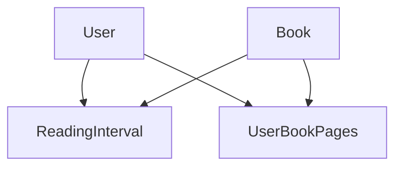

# Book Reading API

A NestJS application for managing book reading progress with PostgreSQL database and Redis caching.

## Implementation Coverage

### Table of Contents
1. [Book Reading Progress Tracking](#1-book-reading-progress-tracking)
2. [Authentication & Authorization](#2-authentication--authorization)
3. [Exception Handling & Logging](#3-exception-handling--logging)
4. [Background Processing](#4-background-processing)
5. [Test Coverage](#5-test-coverage)
6. [Database Schema & Relations](#6-database-schema--relations)

### 1. Book Reading Progress Tracking

- **Reading Interval Submission**
  - Users can submit reading intervals with start and end pages for any book
  - Multiple intervals allowed per user per book
  - Background processing ensures accurate page counting
  - Validates page ranges against book's total pages
  - Handles concurrent submissions efficiently

- **Top Books Recommendation**
  - Shows top 5 books based on unique pages read
  - Aggregates reading data across all users
  - Real-time sorting by most to least read pages
  - Efficient caching for performance optimization
  - Updates automatically as new intervals are submitted

### 2. Authentication & Authorization

- **JWT-based Authentication**
  - Secure login endpoint that returns JWT token upon successful authentication
  - Token includes user information and roles for authorization
  - Token expiration and refresh mechanism implemented

- **JWT Strategy & Guards**
  - Passport JWT Strategy for validating tokens and extracting user information
  - Custom guards implementation for role-based access control
  - Automatic token validation on protected routes

- **Protected Routes**
  - Routes are protected by default requiring valid JWT token
  - Role-based access control using guards for endpoint authorization
  - Support for public routes that bypass authentication
  - Admin-only routes for sensitive operations

### 3. Exception Handling & Logging
- **Global Exception Filter**
  - Standardized error responses
  - HTTP exception handling
  - Custom error types

- **Winston Logger Integration**
  ```typescript
  // Daily rotating log files
  WinstonModule.forRoot({
    transports: [
      new DailyRotateFile({
        filename: 'logs/error-%DATE%.log',
        level: 'error',
        ...
      }),
      new DailyRotateFile({
        filename: 'logs/combined-%DATE%.log',
        ...
      })
    ]
  })
  ```

### 4. Background Processing
- **Bull Queue Implementation**
  ```typescript
  @Processor('reading-interval')
  export class ReadingIntervalProcessor {
    @Process('submit-reading')
    async handleSubmitReading(job: Job<SubmitIntervalDto>) {
      // Background processing of reading intervals
      // Updates unique pages count in a transaction
    }
  }
  ```

### 5. Test Coverage

The application includes comprehensive unit tests for core functionality:

#### BookService Tests
```bash
# Run all tests
docker-compose exec api npm run
# Run tests with coverage
docker-compose exec api npm run
# Run BookService tests specifically
docker-compose exec api npm run test src/book/book.service.spec.ts
```

Coverage includes:
- `submitInterval`: Submitting reading intervals and queueing background jobs
- `getMostRecommendedFiveBooks`: Retrieving top 5 books by unique read pages
- `storeBook`: Creating new books with validation
- `updateBook`: Updating existing books with error handling

### 6. Database Schema & Relations

#### Entity Relationships


#### Access Control Matrix
| Endpoint | Admin | User |
|----------|-------|------|
| POST /books | ✓ | ✗ |
| PUT /books | ✓ | ✗ |
| POST /reading-intervals | ✓ | ✓ |

## Getting Started

1. Clone the repository:
```bash
git clone git@github.com:AhmedSafwat1/octane-task.git
cd <project-directory>
```

2. Create a `.env` file in the root directory with the following content:
```env
# Database Configuration
POSTGRES_USER=postgres
POSTGRES_PASSWORD=postgres
POSTGRES_DB=book_db

# JWT Configuration
JWT_SECRET=your-secret-key
JWT_EXPIRES_IN=14d

# App Configuration
NODE_ENV=development
PORT=3000
```

## Running the Application

### Using Docker Compose

1. Build and start all services:
```bash
docker-compose up -d
```

2. Stop all services:
```bash
docker-compose down
```

3. View logs:
```bash
# All services
docker-compose logs

# Specific service
docker-compose logs api
docker-compose logs postgres
```

4. Rebuild services after changes:
```bash
docker-compose build
docker-compose up -d
```

### Available Services

The application runs the following services:

- API (NestJS): http://localhost:3000
- PostgreSQL: localhost:5436
- Redis: localhost:6380
- pgAdmin: http://localhost:5050
  - Email: admin@admin.com
  - Password: admin

## API Documentation

The API documentation is available through Swagger UI:

- URL: http://localhost:3000/api-doc
- Interactive API documentation with request/response examples
- Authentication endpoints and JWT token usage
- All available endpoints and their parameters

## Database Schema

### Books Table
```sql
CREATE TABLE books (
    id SERIAL PRIMARY KEY,
    name VARCHAR(255) NOT NULL,
    num_of_pages INTEGER NOT NULL,
    unique_read_pages INTEGER DEFAULT 0,
    last_update_unique_read_pages TIMESTAMP,
    created_at TIMESTAMP DEFAULT CURRENT_TIMESTAMP,
    updated_at TIMESTAMP DEFAULT CURRENT_TIMESTAMP
);
```

### Users Table
```sql
CREATE TABLE users (
    id SERIAL PRIMARY KEY,
    name VARCHAR(255) NOT NULL,
    email VARCHAR(255) UNIQUE NOT NULL,
    password VARCHAR(255) NOT NULL,
    roles JSONB DEFAULT '["user"]',
    created_at TIMESTAMP DEFAULT CURRENT_TIMESTAMP,
    updated_at TIMESTAMP DEFAULT CURRENT_TIMESTAMP
);
```

### Reading Intervals Table
```sql
CREATE TABLE reading_intervals (
    id SERIAL PRIMARY KEY,
    user_id INTEGER REFERENCES users(id),
    book_id INTEGER REFERENCES books(id),
    start_page INTEGER NOT NULL,
    end_page INTEGER NOT NULL,
    created_at TIMESTAMP DEFAULT CURRENT_TIMESTAMP,
    CONSTRAINT valid_page_range CHECK (end_page >= start_page)
);
```

### User Book Pages Table
```sql
CREATE TABLE user_book_pages (
    id SERIAL PRIMARY KEY,
    user_id INTEGER REFERENCES users(id),
    book_id INTEGER REFERENCES books(id),
    page_number INTEGER NOT NULL,
    created_at TIMESTAMP DEFAULT CURRENT_TIMESTAMP,
    CONSTRAINT unique_user_book_page UNIQUE(user_id, book_id, page_number)
);
```

### Database Indexes
- `idx_unique_read_pages` on books(unique_read_pages)
- `idx_email` on users(email)
- `idx_user_book` on reading_intervals(user_id, book_id)
- `idx_user_book_page` on user_book_pages(user_id, book_id, page_number)
