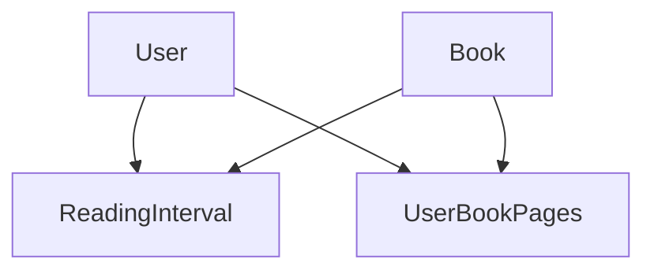

# Book Reading API

A NestJS application for managing book reading progress with PostgreSQL database and Redis caching.

## Implementation Coverage

### 1. Authentication & Authorization
- **JWT-based Authentication**
  - Access token required for protected endpoints
  - Token validation and expiration handling
  - Secure password hashing with bcrypt

- **Role-Based Authorization**
  - User roles: `admin`, `user`
  - Role-based route protection using Guards
  - Custom decorators for role checking
  ```typescript
  @Roles('admin')
  @Post('books')
  createBook(@Body() createBookDto: CreateBookDto) {
    // Only admin can create books
  }
  ```

### 2. Exception Handling & Logging
- **Global Exception Filter**
  - Standardized error responses
  - HTTP exception handling
  - Custom error types

- **Winston Logger Integration**
  ```typescript
  // Daily rotating log files
  WinstonModule.forRoot({
    transports: [
      new DailyRotateFile({
        filename: 'logs/error-%DATE%.log',
        level: 'error',
        ...
      }),
      new DailyRotateFile({
        filename: 'logs/combined-%DATE%.log',
        ...
      })
    ]
  })
  ```

### 3. Background Processing
- **Bull Queue Implementation**
  ```typescript
  @Process('calculate-unique-pages')
  async calculateUniquePages(job: Job<{ bookId: number }>) {
    // Background processing of unique pages
  }
  ```

### 4. Database Schema & Relations

#### Entity Relationships


#### Access Control Matrix
| Endpoint | Admin | User |
|----------|-------|------|
| POST /books | ✓ | ✗ |
| PUT /books | ✓ | ✗ |
| POST /reading-intervals | ✓ | ✓ |

## Getting Started

1. Clone the repository:
```bash
git clone git@github.com:AhmedSafwat1/octane-task.git
cd <project-directory>
```

2. Create a `.env` file in the root directory with the following content:
```env
# Database Configuration
POSTGRES_USER=postgres
POSTGRES_PASSWORD=postgres
POSTGRES_DB=book_db

# JWT Configuration
JWT_SECRET=your-secret-key
JWT_EXPIRES_IN=14d

# App Configuration
NODE_ENV=development
PORT=3000
```

## Running the Application

### Using Docker Compose

1. Build and start all services:
```bash
docker-compose up -d
```

2. Stop all services:
```bash
docker-compose down
```

3. View logs:
```bash
# All services
docker-compose logs

# Specific service
docker-compose logs api
docker-compose logs postgres
```

4. Rebuild services after changes:
```bash
docker-compose build
docker-compose up -d
```

### Available Services

The application runs the following services:

- API (NestJS): http://localhost:3000
- PostgreSQL: localhost:5436
- Redis: localhost:6380
- pgAdmin: http://localhost:5050
  - Email: admin@admin.com
  - Password: admin

## API Documentation

The API documentation is available through Swagger UI:

- URL: http://localhost:3000/api-doc
- Interactive API documentation with request/response examples
- Authentication endpoints and JWT token usage
- All available endpoints and their parameters

## Database Schema

### Books Table
```sql
CREATE TABLE books (
    id SERIAL PRIMARY KEY,
    name VARCHAR(255) NOT NULL,
    num_of_pages INTEGER NOT NULL,
    unique_read_pages INTEGER DEFAULT 0,
    last_update_unique_read_pages TIMESTAMP,
    created_at TIMESTAMP DEFAULT CURRENT_TIMESTAMP,
    updated_at TIMESTAMP DEFAULT CURRENT_TIMESTAMP
);
```

### Users Table
```sql
CREATE TABLE users (
    id SERIAL PRIMARY KEY,
    name VARCHAR(255) NOT NULL,
    email VARCHAR(255) UNIQUE NOT NULL,
    password VARCHAR(255) NOT NULL,
    roles JSONB DEFAULT '["user"]',
    created_at TIMESTAMP DEFAULT CURRENT_TIMESTAMP,
    updated_at TIMESTAMP DEFAULT CURRENT_TIMESTAMP
);
```

### Reading Intervals Table
```sql
CREATE TABLE reading_intervals (
    id SERIAL PRIMARY KEY,
    user_id INTEGER REFERENCES users(id),
    book_id INTEGER REFERENCES books(id),
    start_page INTEGER NOT NULL,
    end_page INTEGER NOT NULL,
    created_at TIMESTAMP DEFAULT CURRENT_TIMESTAMP,
    CONSTRAINT valid_page_range CHECK (end_page >= start_page)
);
```

### User Book Pages Table
```sql
CREATE TABLE user_book_pages (
    id SERIAL PRIMARY KEY,
    user_id INTEGER REFERENCES users(id),
    book_id INTEGER REFERENCES books(id),
    page_number INTEGER NOT NULL,
    created_at TIMESTAMP DEFAULT CURRENT_TIMESTAMP,
    CONSTRAINT unique_user_book_page UNIQUE(user_id, book_id, page_number)
);
```

### Database Indexes
- `idx_unique_read_pages` on books(unique_read_pages)
- `idx_email` on users(email)
- `idx_user_book` on reading_intervals(user_id, book_id)
- `idx_user_book_page` on user_book_pages(user_id, book_id, page_number)
